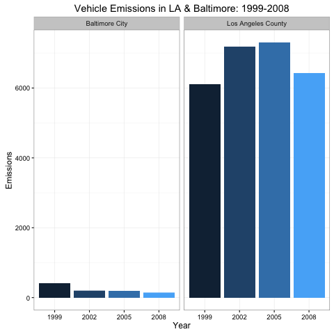

Exploratory Data Analysis - Course Project 2
============================================

### Question 1

**Have total emissions from PM2.5 decreased in the United States from 1999 to 2008?**

Aggregate emission totals for each of the years 1999, 2002, 2005, and 2008.


```r
aggTot <- aggregate(Emissions ~ year,NEI, sum)
```

Using barplot to show emissions by year,


```r
barplot(
        (aggTot$Emissions)/10^6,
        names.arg=aggTot$year,
        xlab="Year",
        ylab="Emissions",
        main="Total Emissions From All US Sources"
)
```

 

Answer:  Total emissions HAVE decreased in the US from 1999 to 2008.

### Question 2

**Have total emissions from PM2.5 decreased in the Baltimore City, Maryland (fips == "24510") from 1999 to 2008?**

Aggregate Emission Totals for Baltimore from 1999 to 2008.


```r
baltimoreEmissions <- NEI[NEI$fips=="24510",]
aggTotBalt <- aggregate(Emissions ~ year, baltimoreEmissions,sum)
```

User barplot to see Baltimore Emissions,


```r
barplot(
  aggTotalsBaltimore$Emissions,
  names.arg=aggTotalsBaltimore$year,
  xlab="Year",
  ylab="PM2.5 Emissions (Tons)",
  main="Total PM2.5 Emissions From All Baltimore City Sources"
)
```

 

Answer:  Total emissions from PM2.5 HAVE decreased in Baltimore from 1999 to 2008.

### Question 3

**Of the four types of sources indicated by the type (point, nonpoint, onroad, nonroad) variable, which of these four sources have seen decreases in emissions from 1999–2008 for Baltimore City?**

**Which have seen increases in emissions from 1999–2008?**

ggplot2 this sucker:

```r
library(ggplot2)

plot3 <- ggplot(baltimoreEmissions,aes(factor(year),Emissions,fill=type)) +
        geom_bar(stat="identity") +
        theme_bw() + guides(fill=FALSE)+
        facet_grid(.~type,scales = "free",space="free") + 
        labs(x="year", y=expression("Emissions")) + 
        labs(title=expression("Emissions, Baltimore City 1999-2008 by Type"))

print(plot3)
```

 

Answer:  The `non-road`, `nonpoint`, `on-road` types all saw decreased emissions from 1999-2008 in Baltimore.

The `point` type increased from 1999-2008, however increased until 2005 and then decreased again in 2008.

### Question 4

**Across the United States, how have emissions from coal combustion-related sources changed from 1999–2008?**

Subset coal combustion factors:


```r
combustRecords <- grepl("comb", SCC$SCC.Level.One, ignore.case=TRUE)
coalRecords <- grepl("coal", SCC$SCC.Level.Four, ignore.case=TRUE) 
coal_combust_records <- (combustRecords & coalRecords)
c_SCC <- SCC[coal_combust_records,]$SCC
c_NEI <- NEI[NEI$SCC %in% c_SCC,]
```

ggplot2 Coal and Combustion:

```r
library(ggplot2)

ggp <- ggplot(combustionNEI,aes(factor(year),Emissions/10^5)) +
  geom_bar(stat="identity",fill="grey",width=0.75) +
  theme_bw() +  guides(fill=FALSE) +
  labs(x="year", y=expression("Total PM"[2.5]*" Emission (10^5 Tons)")) + 
  labs(title=expression("PM"[2.5]*" Coal Combustion Source Emissions Across US from 1999-2008"))

print(ggp)
```

 

Answer:  Coal combustion related emissions have decreased from 1999-2008.

### Question 5

**How have emissions from motor vehicle sources changed from 1999–2008 in Baltimore City?**

Subset the vehicle related emissions:


```r
veh <- grepl("vehicle", SCC$SCC.Level.Two, ignore.case=TRUE)
veh_SCC <- SCC[veh,]$SCC
veh_NEI <- NEI[NEI$SCC %in% veh_SCC,]
```

Baltimore Vehicle Subset:


```r
baltVehicleNEI <- veh_NEI[veh_NEI$fips=="24510",]
```

ggplot2 Baltimore Vehicle Emissions:


```r
plot5 <- ggplot(baltVehicleNEI,aes(factor(year),Emissions)) +
        geom_bar(stat="identity",fill="orange",width=0.75) +
        theme_bw() +  guides(fill=FALSE) +
        labs(x="Year", y=expression("Emissions")) + 
        labs(title=expression("Baltimore Vehicle Emissions: 1999-2008"))

print(plot5)
```

 

Answer:  Baltimore Vehicle Emissions have decreased from 1999-2008.

### Question 6


**Which city has seen greater changes over time in motor vehicle emissions?**

Subseting Baltimore and LA vehicle emission records and binding them:


```r
baltVehicleNEI <- veh_NEI[veh_NEI$fips=="24510",]
baltVehicleNEI$city <- "Baltimore City"

LAVehiclesNEI <- veh_NEI[veh_NEI$fips=="06037",]
LAVehiclesNEI$city <- "Los Angeles County"

LA_Baltimore <- rbind(baltVehicleNEI,LAVehiclesNEI)
```

ggplot2 Baltimore vs LA:


```r
plot6 <- ggplot(LA_Baltimore, aes(x=factor(year), y=Emissions, fill=city)) +
        geom_bar(aes(fill=year),stat="identity") +
        facet_grid(scales="free", space="free", .~city) +
        guides(fill=FALSE) + theme_bw() +
        labs(x="Year", y=expression("Emissions")) + 
        labs(title=expression("Vehicle Emissions in LA & Baltimore: 1999-2008"))

print(plot6)
```

 

Answer:  Although LA still has much higher emissions than Baltimore, it has seen greater nominal change in emissions over time.
